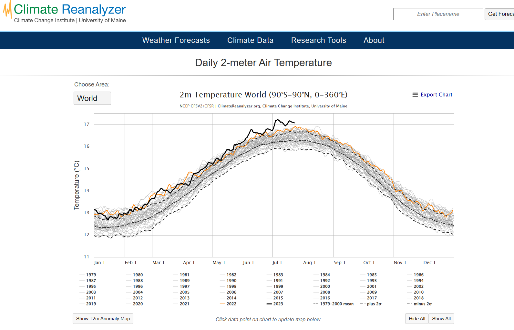
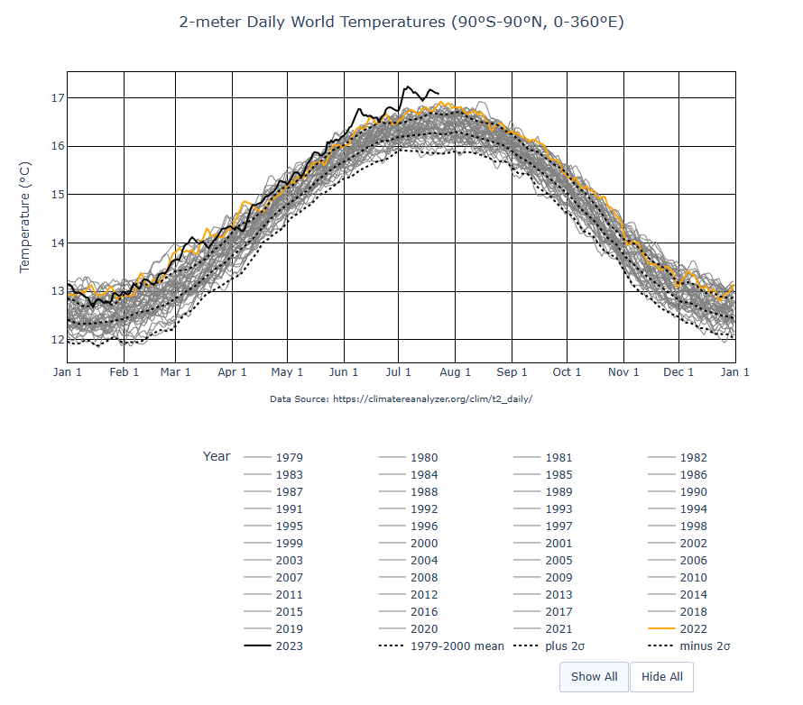

# Climate-Reanalyzer Chart

## Background

I discovered an interesting website https://climatereanalyzer.org/. I decided to recreate one of the graphs I discovered as close as possible.

The image can be found here.

I generated my code in a Jupyter notebook and then compiled it into a python file and came up with this result:

